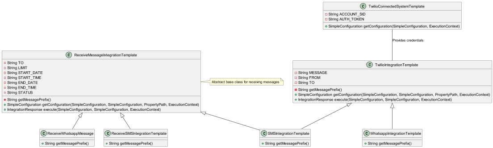
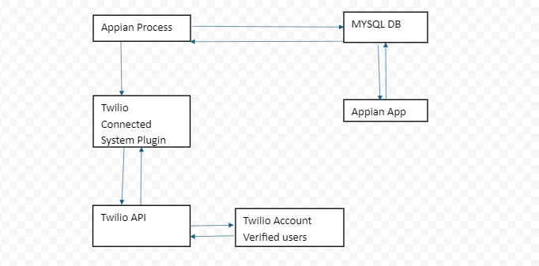

---

# Twilio Appian Connected System Plugin

## Overview

The Twilio Appian Connected System provides integration between Appian and Twilio’s communication services, including SMS and WhatsApp messaging. This connected system allows you to send and receive messages through Twilio's API from within Appian.
## Class Diagram

## Chat Flow Architecture


### Required Dependencies

To work with the Twilio Appian Connected System, include the following dependencies in your build configuration:

```gradle
dependencies {
    // Appian Connected Systems SDK
    compileOnly 'com.appian:connected-systems-core:1.2.0'
    implementation 'com.appian:connected-systems-client:1.1.0'

    // Twilio Java SDK
    implementation 'com.twilio.sdk:twilio:10.4.1'

    // Jackson libraries for JSON and XML processing
    implementation 'com.fasterxml.jackson.core:jackson-core:2.17.2'
    implementation 'com.fasterxml.jackson.core:jackson-annotations:2.17.2'
    implementation 'com.fasterxml.jackson.core:jackson-databind:2.17.2'
    implementation 'com.fasterxml.jackson.dataformat:jackson-dataformat-xml:2.17.2'
    implementation 'com.fasterxml.jackson.datatype:jackson-datatype-jsr310:2.17.2'

    // SLF4J for logging
    implementation 'org.slf4j:slf4j-api:2.0.13'
    testImplementation 'org.slf4j:slf4j-nop:2.0.13'
    
    // Testing dependencies
    testImplementation 'com.appian:connected-systems-core:1.2.0'
}
```

### Configuration Properties

The Twilio connected system requires the following properties to be configured:

- **Account SID**: The unique identifier for your Twilio account. This is required for authenticating API requests.
- **Auth Token**: The secret token used to authenticate your Twilio account. This should be kept confidential.

### Configuration Steps

1. **Create a New Connected System**:
    - In Appian Designer, navigate to the "Connected Systems" section.
    - Click on "New Connected System."

2. **Set Up the Connected System**:
    - **Name**: Enter a name for your connected system (e.g., "Twilio Integration").
    - **Description**: Provide a description of the connected system (e.g., "Integration with Twilio API for sending and receiving SMS and WhatsApp messages").
    - **Category**: Select a category for your connected system.

3. **Configure Authentication**:
    - **Account SID**: Add a text property for the Twilio Account SID.
    - **Auth Token**: Add a text property for the Twilio Auth Token.

4. **Add Configuration Properties**:
    - **Account SID**:
        - Property Name: `accountSID`
        - Description: Your Twilio Account SID.
        - Type: Text
    - **Auth Token**:
        - Property Name: `authToken`
        - Description: Your Twilio Auth Token.
        - Type: Text

5. **Save and Publish the connected system**.

## Integration Templates

### TwilioIntegrationTemplate

The `TwilioIntegrationTemplate` class provides a framework for sending SMS messages via Twilio. The following configurations and methods are used:

#### Configuration Properties

- **Message (msg)**: The body of the message to be sent.
- **From Number (from)**: The phone number from which the message is sent.
- **To Number (to)**: The phone number to which the message is sent.

#### Methods

- **getMessagePrefix()**: Abstract method to be implemented to provide a prefix for the message body.
- **getConfiguration(...)**: Configures the integration properties for sending SMS.
- **execute(...)**: Sends an SMS message using the Twilio API and returns the result or error information.

#### Error Handling

- **ApiException**: Handles errors from the Twilio API.
- **Exception**: Handles unexpected errors during execution.

### WhatsappIntegrationTemplate

The `WhatsappIntegrationTemplate` class extends `TwilioIntegrationTemplate` to support sending messages via WhatsApp.

#### Implementation

```java
package com.lcm.twilio.templates;

import com.appian.connectedsystems.templateframework.sdk.TemplateId;

@TemplateId(name = "WhatsappIntegrationTemplate")
public class WhatsappIntegrationTemplate extends TwilioIntegrationTemplate {

  @Override
  protected String getMessagePrefix() {
    return "whatsapp:";
  }
}
```

#### Configuration

- **Message Prefix**: The prefix "whatsapp:" is added to the message body to indicate that the message is to be sent via WhatsApp.

#### Example Usage

**Sending an SMS**:
1. Initialize the Twilio Client:
    - Use the Twilio Account SID and Auth Token from the connected system configuration.
2. Create a Message:
    - Use the `Message.creator()` method from the Twilio Java SDK to create and send a message.
3. Handle Response:
    - Check the message status and SID for success or error handling.

**Sending a WhatsApp Message**:
1. Initialize the Twilio Client:
    - Use the Twilio Account SID and Auth Token from the connected system configuration.
2. Create a WhatsApp Message:
    - Use the `Message.creator()` method from the Twilio Java SDK with the prefix "whatsapp:" to send a WhatsApp message.
3. Handle Response:
    - Check the message status and SID for success or error handling.

### ReceiveMessageIntegrationTemplate

The `ReceiveMessageIntegrationTemplate` class provides a framework for receiving messages via Twilio.

#### Configuration Properties

- **To Number (to)**: The phone number from which to receive messages.
- **Message Limit (limit)**: The maximum number of messages to retrieve.
- **Start Date (startDate)**: The start date for filtering messages.
- **Start Time (startTime)**: The start time for filtering messages.
- **End Date (endDate)**: The end date for filtering messages.
- **End Time (endTime)**: The end time for filtering messages.
- **Status (status)**: Filter messages by status (e.g., 'read', 'undelivered').

#### Methods

- **getMessagePrefix()**: Abstract method to provide a prefix for the message body.
- **getConfiguration(...)**: Configures the integration properties for receiving messages.
- **execute(...)**: Retrieves messages from Twilio using the specified filters and returns the result or error information.

#### Example Usage

1. **Initialize the Twilio Client**:
    - Use the Twilio Account SID and Auth Token from the connected system configuration.

2. **Retrieve Messages**:
    - Use the `Message.reader()` method from the Twilio Java SDK to fetch messages based on the specified parameters (e.g., date range, status).

3. **Filter and Process Messages**:
    - Apply any additional filtering (e.g., by date, time, or status) and process the retrieved messages as needed.

#### Error Handling

- **ApiException**: Handles errors from the Twilio API.
- **Exception**: Handles unexpected errors during execution.

## Diagnostics

The integration provides diagnostic information including:

- **Execution Time**: Time taken to execute the message sending or receiving operation.
- **Request Diagnostic**: Information about the request parameters.

## Troubleshooting

- **Invalid Credentials**: Ensure that the Account SID and Auth Token are correct and have not expired.
- **Network Issues**: Verify network connectivity and Twilio service availability.
- **API Errors**: Refer to Twilio’s API documentation for detailed error messages and solutions.

## References

- [Twilio API Documentation](https://www.twilio.com/docs/usage/api)
- [Appian Connected Systems Documentation](https://docs.appian.com/suite/help/23.4/Connected_Systems.html)

---